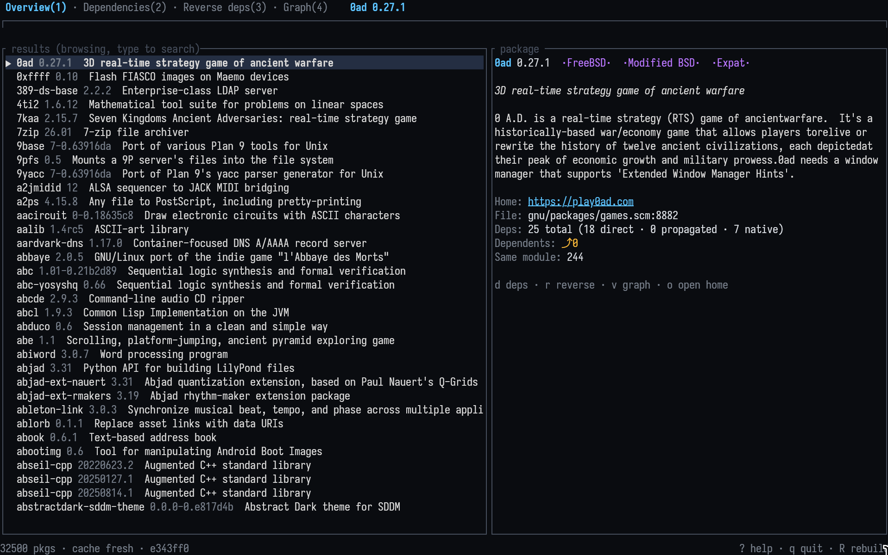
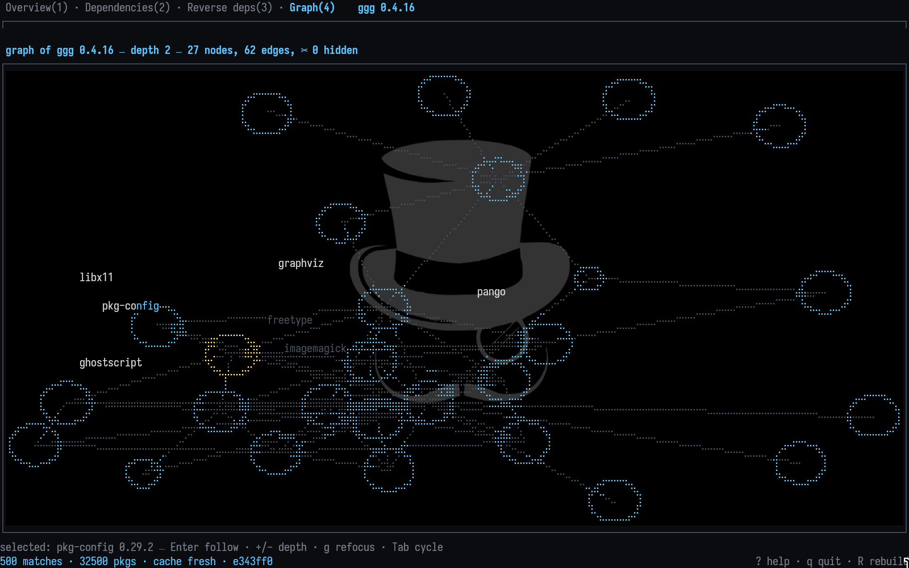
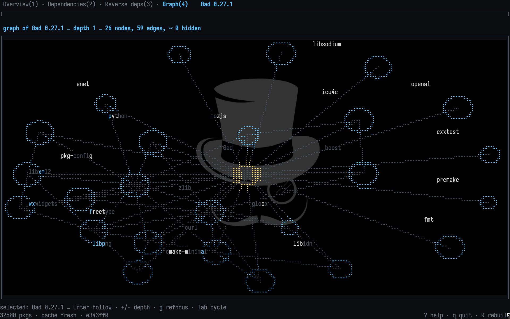
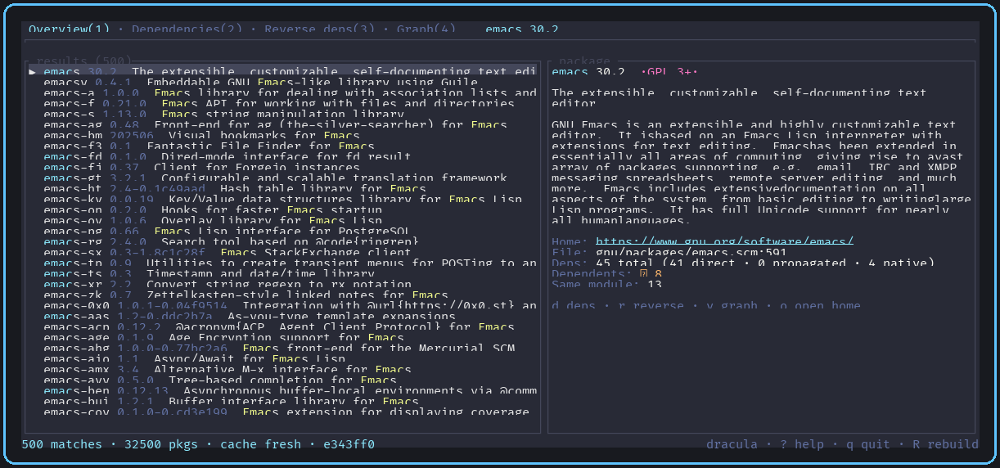

# tui

Package explorer for the **CyberDeck package manager** — a terminal UI
(Rust + ratatui): search **every** known package, inspect its pin and
provenance, walk what it needs and what needs it, with fast fuzzy search
and a polished, keyboard-first interface.

```
┌─ Search: emac▌────────────────────────────────────────────────┐
│  [Overview(1)] [Dependencies(2)] [Reverse deps(3)]            │
│ ┌───────────────────────────┐ ┌──────────────────────────────┐│
│ │ ▶ emacs  30.2  GPL 3+     │ │ GNU Emacs is an extensible…   ││
│ │   emacs-minimal  30.2     │ │                              ││
│ │   emacs-next  31.0        │ │ Source: example.org/emacs.git ││
│ │   (fuzzy match highlights)│ │ Commit: 9edb3f66              ││
│ └───────────────────────────┘ └──────────────────────────────┘│
│ 157 matches · 10 pkgs · cache fresh · 9edb3f6 · ? help        │
└───────────────────────────────────────────────────────────────┘
```

## Features

- **Search anything** — fuzzy search across all packages (name + synopsis),
  highlighted matches, live results as you type.
- **Package details** — version, description, licenses, homepage, plus the
  manager's own provenance: source URL, pinned commit, install status.
- **Dependencies** — expandable tree of inputs (`P` propagated, `N` native),
  with dependent counts per node (`⤴ 12`).
- **Reverse dependencies** — "who depends on this package": direct list plus
  a depth-limited transitive section.
- **Instant startup on later runs** — the last good snapshot is cached as
  gzipped JSON; `--rebuild` re-reads the snapshot file.
- **Zero surveying** — the TUI never shells out. The package manager writes
  the snapshot; the TUI only reads it.

## Snapshot file (the CLI seam)

The TUI reads one JSON document — the package snapshot. Resolve order:

1. `tui --snapshot PATH`
2. `$CYBERDECK_SNAPSHOT`
3. `./snapshot.json`

Schema (`schema: 3`):

```json
{
  "header": {
    "schema": 3,
    "state": "9edb3f66",
    "generated_ms": "0",
    "package_count": 2
  },
  "packages": [
    {
      "id": 0,
      "name": "emacs",
      "version": "30.2",
      "synopsis": "The extensible text editor",
      "description": "GNU Emacs is an extensible text editor.",
      "homepage": "https://www.gnu.org/software/emacs/",
      "licenses": ["GPL 3+"],
      "inputs": ["gtk+"],
      "propagated_inputs": [],
      "native_inputs": ["texinfo"],
      "deps": ["gtk+", "texinfo"],
      "source_url": "https://example.org/emacs.git",
      "commit": "9edb3f66",
      "status": "installed"
    }
  ]
}
```

Rules:

- `id` values are `0..package_count`, unique, and `package_count` must
  equal the length of `packages`.
- `deps` lists exact pins and wins over the three legacy `inputs*` lists
  when both are present; unknown dep names are dropped, never fatal.
- `file` (`[path, line]`) is legacy metadata and optional; all other
  fields default to empty when absent, so older documents keep parsing.

The future `pm` CLI command will emit exactly this document; until then,
any tool that writes the shape above works.

## Demo video

[](assets/tui-demo.mp4)

## Screenshots

Search and package details:


Dependency tree (expand/collapse with Enter):



Reverse dependencies (who depends on this package):



## Themes

The TUI ships with eight selectable color themes: **dark** (default),
**one**, **light**, **dracula**, **nord**, **gruvbox-dark**, **tokyo-night**
and **catppuccin-mocha**.

- TUI: press `T` to cycle (the active theme is shown in the status bar);
  `NO_COLOR` is honored with a grayscale fallback.

The TUI in the dracula theme:



## Requirements

- Rust 1.85+ (edition 2021) to build from source.
- A snapshot JSON file (see above) to explore anything.

## Install

### From source (cargo)

```sh
git clone <your-cyberdeck-remote> cyberdeck
cd cyberdeck/tui
cargo install --path .            # installs to ~/.cargo/bin
# or, to put it on your PATH directly:
cargo install --root ~/.local --path .
tui --snapshot /path/to/snapshot.json
```

## Usage

```
tui --snapshot snapshot.json     start the explorer
tui --rebuild --snapshot snap.json   re-read the snapshot, refresh cache
tui --help                       all options
```

`CYBERDECK_SNAPSHOT` sets the default snapshot path so the flag can be
omitted.

### Keymap

| Key | Action |
|---|---|
| type | fuzzy search (always live) |
| `Esc` | clear search / back out |
| `Tab` / `Shift+Tab` | cycle tabs |
| `1`–`3` | jump to tab (Overview, Dependencies, Reverse deps) |
| `↑` `↓` (or `j` `k` with empty search) | move selection |
| `PgUp` / `PgDn` | page |
| `Enter` | expand/collapse tree node |
| `d` / `r` (empty search) | open dependencies / reverse deps |
| `h` / `l` or `←` / `→` | collapse / expand tree node |
| `g` / `G` (empty search) | top / bottom |
| `o` (empty search) | open homepage in `$BROWSER`/`xdg-open` |
| `T` | cycle theme (8 palettes) |
| `R` | reload the snapshot in the background |
| `?` | help |
| `q` (empty search) / `Ctrl+C` | quit |

Command letters (`d`, `r`, `j`, `k`, `g`, `G`, `q`, `o`, `1`–`3`)
act only while the search box is empty, so typing is never hijacked; use the
arrow keys to navigate while typing.

### Tabs

1. **Overview** — result list + detail pane.
2. **Dependencies** — expandable tree of what the package needs.
3. **Reverse deps** — direct dependents (expandable) + transitive section
   (depth 2+, press Enter on the section header to open it).

## How it works

On startup tui either loads its cache or reads the snapshot file,
validates the document (ids, count, names), computes reverse dependency
edges, and stores the index in memory; the raw JSON is cached gzipped
under:

```
~/.cache/tui/index-v3.json.gz
```

A corrupt cache is quarantined (renamed, never silently deleted) and the
snapshot is re-read.

Layout: `src/index.rs` (in-memory index + BFS), `src/search.rs` (nucleo
fuzzy search worker), `src/indexer.rs` (snapshot file loader),
`src/cache.rs` (gzipped cache), `src/app.rs` (state + keys), `src/ui/*`
(rendering).

## Development

```sh
cargo fmt --check
cargo clippy --all-targets -- -D warnings
cargo test                                   # unit + fixture tests
```

## Troubleshooting

- **"snapshot load failed"** — pass `--snapshot PATH` or export
  `CYBERDECK_SNAPSHOT`; tui also accepts `./snapshot.json`.
- **Empty snapshot** — the file must hold one JSON document in the schema
  above with `package_count` matching the package list length.
- **Stale data** — press `R` to re-read the snapshot, or delete
  `~/.cache/tui/` and restart.
- **No colors** — `NO_COLOR` is honored (grayscale theme).

## License

GPL-3.0-or-later. See [LICENSE](LICENSE).
